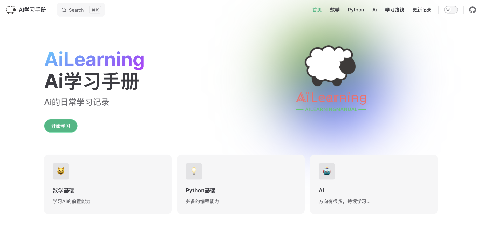

<div align="center">
<br/>
<br/>
  <h1 align="center">
    Ai Learning Manual
  </h1>
  <h4 align="center">
    Ai 学 习 记 录 手 册，记 录 学 习 日 常。
  </h4>
</div>

<p align="center">
    <a href="#">
        
    </a>        
    <a href="#">
        
    </a>
    <a href="#">
        
    </a>
</p>

<div align="center">
  
</div>
<br>

## 项目介绍
> 记录Ai学习过程日常

本项目主要用于Ai学习的过程的记录，方便日常查阅回顾，内容持续更新中...


## 说明

**本地运行**
```shell
# git clone克隆到本地，编译
npm install
# 运行
npm run docs:dev
```